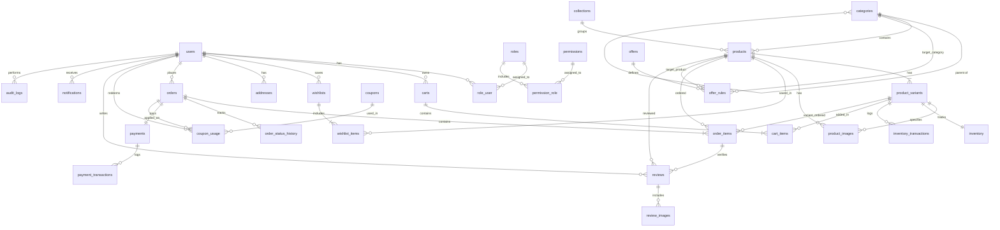

# Femmeera E-Commerce Entity Relationship (ER) Diagram

```mermaid
erDiagram
    users ||--o{ role_user : has
    roles ||--o{ role_user : assigned_to
    roles ||--o{ permission_role : includes
    permissions ||--o{ permission_role : assigned_to

    categories ||--o{ categories : "parent of"
    categories ||--o{ products : contains
    collections ||--o{ products : groups
    products ||--|{ product_variants : has
    products ||--o{ product_images : has
    product_variants ||--o{ product_images : specifies

    product_variants ||--|| inventory : tracks
    product_variants ||--o{ inventory_transactions : logs

    users ||--o{ carts : owns
    carts ||--|{ cart_items : contains
    product_variants ||--o{ cart_items : added_in

    users ||--o{ wishlists : saves
    wishlists ||--|{ wishlist_items : includes
    products ||--o{ wishlist_items : saved_in

    users ||--o{ addresses : has
    users ||--o{ orders : places
    orders ||--|{ order_items : contains
    products ||--o{ order_items : ordered
    product_variants ||--o{ order_items : variant_ordered
    orders ||--o{ order_status_history : tracks

    orders ||--|| payments : pays
    payments ||--o{ payment_transactions : logs

    coupons ||--o{ coupon_usage : used_in
    users ||--o{ coupon_usage : redeems
    orders ||--o{ coupon_usage : applied_on

    offers ||--o{ offer_rules : defines
    products ||--o{ offer_rules : target_product
    categories ||--o{ offer_rules : target_category

    products ||--o{ reviews : reviewed
    users ||--o{ reviews : writes
    order_items ||--o{ reviews : verifies
    reviews ||--o{ review_images : includes

    users ||--o{ notifications : receives
    users ||--o{ audit_logs : performs
```
